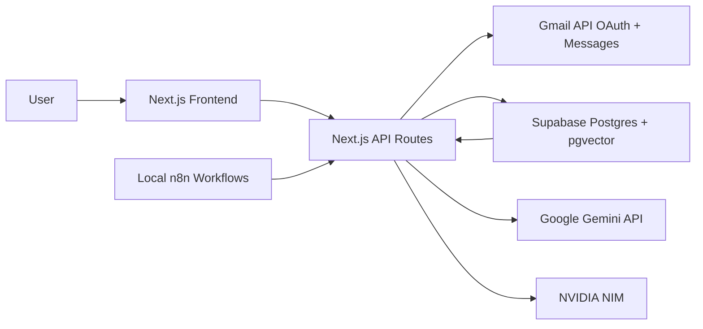

# MailMind Architecture

## 1. System Architecture

MailMind separates product UI, durable data, AI reasoning, and automation orchestration.

### Component Roles

- Next.js frontend: Inbox command center, thread inspection, AI chat, and draft generation.
- Next.js API routes: OAuth callback, Gmail sync, AI processing, RAG retrieval, and draft generation.
- n8n: Scheduled sync and webhook-triggered processing automation.
- Supabase: Durable store for users, Gmail tokens, threads, messages, chunks, embeddings, and AI interaction logs.
- Gemini: Primary model for summarization, source-backed answers, and email drafting.
- NVIDIA NIM: Secondary model used for categorization hints and model diversity.

This is deliberate: n8n handles automation, while normal backend routes handle product APIs, OAuth callback control, and user-facing request/response logic.

## 2. Database Schema

The schema lives in `supabase/schema.sql`.

Main tables:

- `user_profiles`: Single-user or multi-user profile records keyed by email.
- `gmail_oauth_tokens`: OAuth tokens connected to a user.
- `gmail_sync_state`: Stores history IDs, pagination state, and sync timestamps.
- `email_threads`: First-class thread entity with summary, category, priority, facts, and rollups.
- `email_messages`: Individual Gmail messages with headers, labels, snippets, and normalized body text.
- `email_chunks`: Retrieval units for RAG. Each message currently becomes one chunk.
- `ai_interactions`: Audit log for prompts and structured AI responses.

Indexes:

- Thread ordering index by user and latest message date.
- Message ordering index by thread and sent time.
- Full-text GIN index for fallback search.
- pgvector IVFFLAT index for semantic retrieval.

`pgvector` stores Gemini embeddings for email chunks. The current embedding dimension is `768`, matching `text-embedding-004`.

## 3. AI Design

### Summarization

Each synced Gmail thread is represented as ordered messages. The summarizer receives:

- Subject
- Sender
- Sent date
- Normalized plain text body
- Optional category hint from NVIDIA NIM

Gemini returns strict JSON:

- `summary`
- `category`
- `priority`
- `keyFacts`

For long threads, the production strategy is map-reduce summarization:

1. Summarize message windows.
2. Summarize the summaries into a final thread summary.
3. Preserve message IDs used in every step.

The current implementation processes recent thread bodies directly and is designed to be extended to windowing.

### RAG Pipeline

1. Normalize Gmail message body.
2. Store the message in `email_messages`.
3. Create an `email_chunks` row.
4. Embed chunk content with Gemini embeddings.
5. Retrieve with `match_email_chunks`.
6. Fall back to Postgres full-text search if embedding search is unavailable.
7. Ask Gemini to answer using only retrieved source content.
8. Return answer plus source email references.

### Source Clarity

Every retrieved source includes:

- Gmail message ID
- Gmail thread ID
- Subject
- Sender
- Date
- Snippet

The agent prompt explicitly requires source-backed answers. If the answer is not in the synced emails, the model must say that instead of guessing.

### NVIDIA NIM Choice

The default model is configurable through `NVIDIA_NIM_MODEL`, with `meta/llama-3.1-8b-instruct` as a practical free-catalog default. Its role is not to replace Gemini. It is used as a second model for lightweight classification hints, which satisfies the assignment requirement while keeping the architecture simple and free-tier friendly.

### Hallucination Prevention

- The chat route retrieves email sources first.
- Gemini receives only those source chunks as allowed knowledge.
- The prompt forbids outside knowledge.
- The response must include used message IDs.
- UI displays source references beside the answer.
- If retrieval returns no useful evidence, the answer should say the information was not found.

## 4. Gmail API Strategy

### Initial Sync

The app uses:

- `users.messages.list` for message IDs
- `users.messages.get` with `format=full` for normalized message content

The UI defaults to `newer_than:90d` and a batch limit. This is intentional for a demo: a smaller working sync is better than a massive unreliable sync.

### Incremental Sync

The schema includes `gmail_sync_state.history_id`. The production upgrade path is:

1. Store the highest message `historyId` during sync.
2. Use `users.history.list` after initial sync.
3. Fetch only added or changed messages.
4. Update sync state after successful processing.

### Pagination

The sync route supports Gmail `nextPageToken`. The frontend syncs one batch at a time; n8n can repeatedly call the endpoint to continue pagination.

### Rate Limiting and Quotas

`src/lib/gmail.ts` wraps Gmail API calls with retry and exponential backoff for:

- `429`
- `500`
- `502`
- `503`
- `504`

Batch size is capped at `300` per request to avoid runaway quota use.

## 5. Tool and Technology Decisions

- Next.js: Gives frontend and backend routes in one deployable free-tier app.
- Supabase: Free Postgres, auth-ready, and pgvector support.
- n8n: Best fit for scheduled jobs, retries, and visual automation.
- Gemini: Required primary AI model and strong long-context model family.
- NVIDIA NIM: Required secondary model, used for classification hints.
- Gmail API: Required by assignment and supports proper thread/message metadata.

## 6. Trade-offs and Limitations

Built deliberately:

- Working Gmail OAuth and sync path.
- Source-backed chat architecture.
- Thread-aware summaries and draft generation.
- Importable n8n workflow exports.
- Clear database and AI design.

Simplified:

- Sending emails is not automatic. The app drafts for human review. This is safer for a hiring assessment and avoids accidental email sends.
- Initial sync is bounded. Full mailbox sync is documented and schema-supported, but not forced through the UI.
- Newsletter deduplication is not fully implemented. The vector design supports it by clustering semantically similar newsletter chunks.
- Multi-user auth is basic. The app stores a cookie user ID after Gmail OAuth; production should use Supabase Auth or another session system.
- Local n8n cannot serve a deployed app unless n8n is also hosted or tunneled.

With more time, the next upgrades would be:

- Gmail draft creation and send confirmation.
- `users.history.list` incremental sync.
- Newsletter story extraction and semantic deduplication.
- Background queue for AI processing.
- Stronger tenant isolation with Supabase Auth policies.
